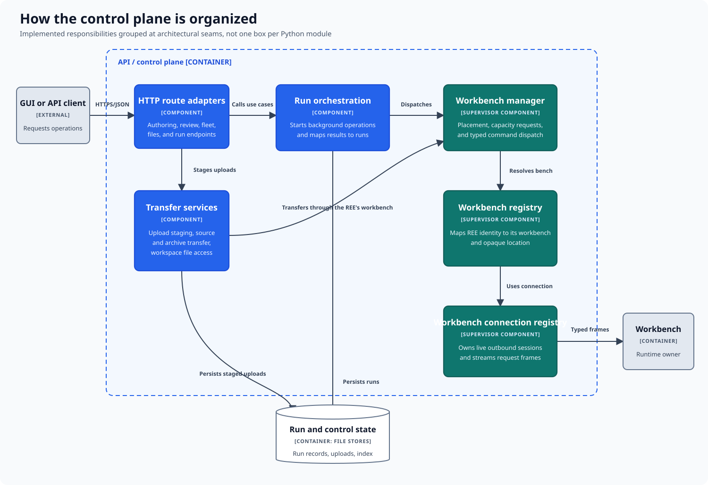

# How the control plane is organized

The control plane translates user requests into tracked operations and routes
those operations to the agent responsible for an REE's workbench.

## Responsibilities

| Area | Responsibility |
|---|---|
| Request adapters | Translate authoring, review, fleet, file, and run requests into operations. |
| Run orchestration | Starts background work and maps progress and results onto run records. |
| Transfer services | Stage uploads and coordinate movement of source, archives, and workspace files. |
| Workbench management | Selects an agent, manages workbench lifecycle, and dispatches typed commands. |
| Workbench routing | Maps an REE identity to its agent and opaque workbench location. |
| Agent connections | Owns live agent sessions and carries request and response messages. |
| Run and control state | Persists run records, uploads, the REE index, and other coordination data. |

Long-running operations are accepted as background runs. Orchestration resolves
the REE's workbench, dispatches work through its connected agent, and updates
the run as messages return. A client can poll that run independently of the
original request.

File transfers follow the same boundary: the control plane stages and
coordinates data, while the selected agent performs effects at the workbench.
The API does not bypass the agent to inspect or modify a workbench.

See [how a pipeline stage runs](pipeline-stage-execution.md) for this
interaction in execution order.

