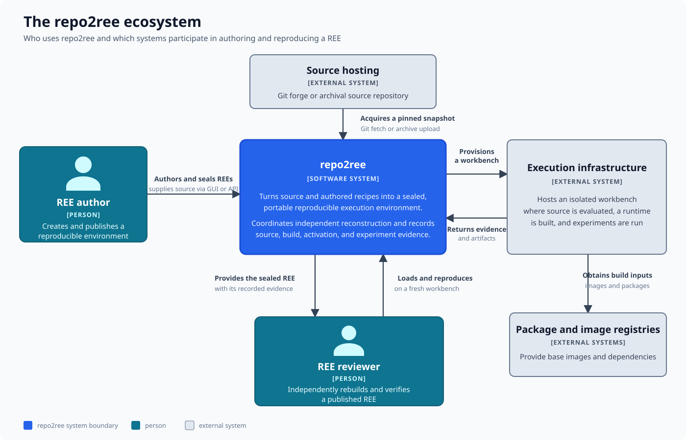

# The repo2ree ecosystem

This map shows who uses repo2ree and which external systems participate in
authoring and independently reproducing a Reproducible Execution Environment
(REE). Internal applications and services are deliberately hidden here.

## People and systems

- **REE authors** provide source and recipes, exercise the environment, and
  seal the resulting REE with its evidence.
- **REE reviewers** load a published REE and reproduce it in a fresh workbench.
- **repo2ree** coordinates both workflows and records evidence for source,
  build, activation, and experiment steps.
- **Source hosting** supplies a pinned Git snapshot or an uploaded archive.
- **Execution infrastructure** hosts the isolated workbench where evaluation,
  builds, and experiments run.
- **Package and image registries** supply external build inputs.

The shareable object passed from author to reviewer is the sealed REE, not the
author's running workbench. Both workflows use execution infrastructure, but
repo2ree coordinates that infrastructure instead of exposing it directly to
the user.

Continue to [services, workbenches, and data stores](services-and-storage.md)
to see what runs inside the repo2ree boundary.

