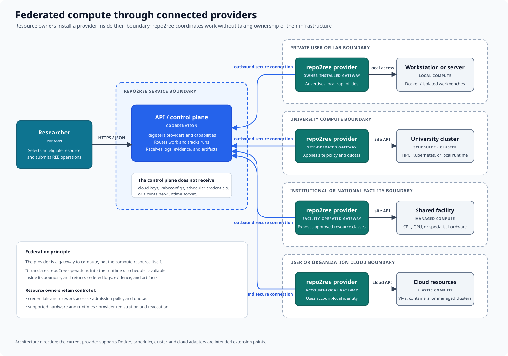

# Federated compute through connected agents

repo2ree is designed to coordinate compute supplied by different resource
owners without taking possession of their infrastructure credentials. A private
user, laboratory, university, facility, or cloud account installs a repo2ree
agent inside its own boundary. That agent connects outward to a repo2ree API
instance and makes approved compute capabilities available for REE operations.

## The agent is a gateway

An agent is not itself the compute resource. It translates repo2ree operations
into calls to the runtime or scheduler available inside its environment. That
may be a local Docker host, an institutional cluster, specialist hardware, or a
cloud-managed service.

The agent advertises the capabilities that its owner chooses to expose. The
control plane can then select an eligible connected agent, route work to it,
track the run, and receive logs, evidence, and artifacts.

## The resource boundary stays intact

Infrastructure access remains local to the agent. The repo2ree API does not
need the owner's cloud keys, kubeconfig, scheduler credentials, or
container-runtime socket. Resource owners continue to control:

- Agent registration and revocation
- Admission policy, quotas, and scheduling
- Available hardware and runtime classes
- Infrastructure credentials and network access

The outbound agent connection also avoids requiring a university, laboratory,
or private network to expose an inbound agent endpoint.

## Current and intended support

The current agent drives Docker and provisions isolated workbenches on its
host. Scheduler, cluster, and cloud adapters shown in the diagram are intended
extension points for federated compute; they are not all implemented today.

