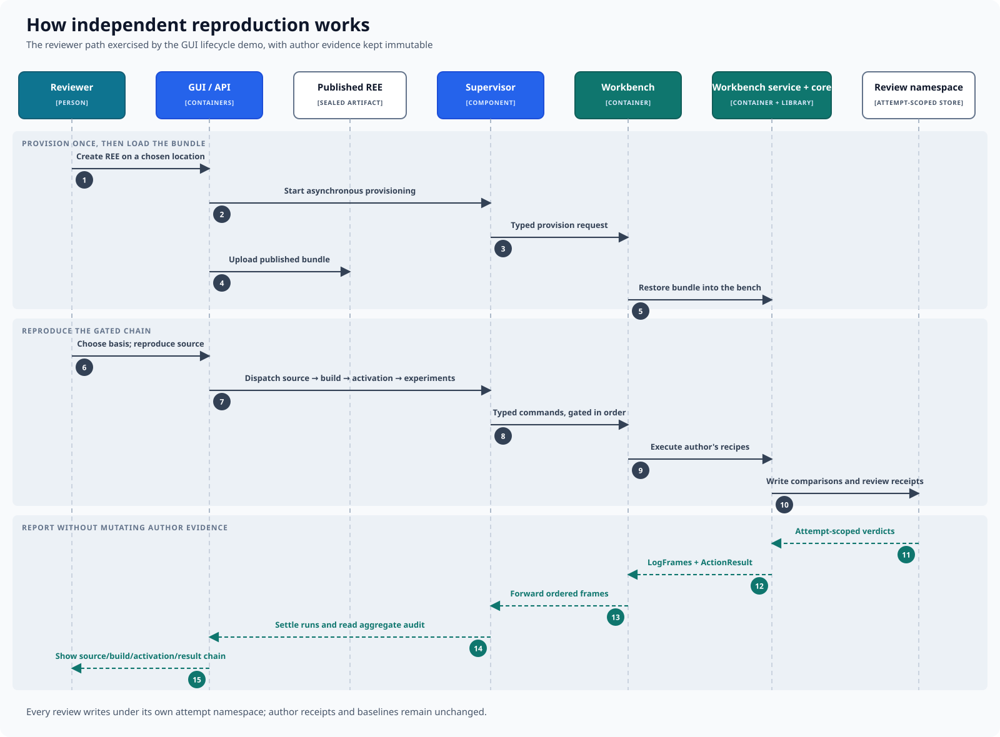

# How independent reproduction works

A review loads a published REE into an isolated workbench and produces a new,
attempt-scoped chain of evidence without changing the author's records.

## Reproduction sequence

1. The reviewer creates an REE on a chosen agent, which provisions its
   workbench once.
2. The published bundle is uploaded and restored into that workbench.
3. The reviewer chooses the reproduction basis and starts source reproduction.
4. The control plane dispatches the gated source, build, activation, and
   experiment operations in order.
5. The workbench executes the author's recipes and writes comparisons and
   review receipts beneath a fresh attempt namespace.
6. Attempt verdicts, logs, and operation results return through the agent and
   settle the corresponding runs.
7. The interface presents the source, build, activation, and result chain.

Each attempt has its own `reviews/<review_id>/` tree. It may compare its outputs
with author baselines, but it never rewrites author receipts or results. One
loaded REE uses one workbench; separate attempts are isolated by their
namespaces within its durable tree rather than by provisioning a workbench for
every stage.

For definitions of validation, reproduction, receipts, and sealing, see the
[concept reference](../concepts.md).

