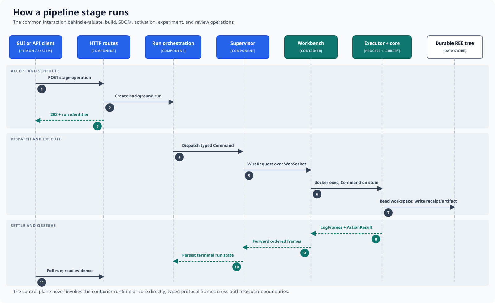

# How a pipeline stage runs

Evaluation, build, SBOM generation, activation, experiment, and review
operations use the same asynchronous path from request to durable evidence.

## Execution sequence

1. A client requests a stage operation through the API.
2. The control plane creates a background run and immediately returns its
   identifier.
3. Run orchestration constructs a typed command and resolves the REE's
   workbench.
4. The command travels over that workbench's own outbound connection.
5. The workbench service starts an executor for the command.
6. The operation reads the workspace and writes its receipt or artifact to the
   durable REE tree.
7. Logs and the terminal result travel back over the same connection.
8. The control plane records the run's final state; the client polls the run
   and reads the resulting evidence.

The original web request does not need to remain open while execution runs.
Messages cross both execution boundaries in a defined format, and returned logs
remain ordered. The control plane does not invoke the runtime or execute
repository operations directly. The provider that created the workbench takes
no part in this path.
