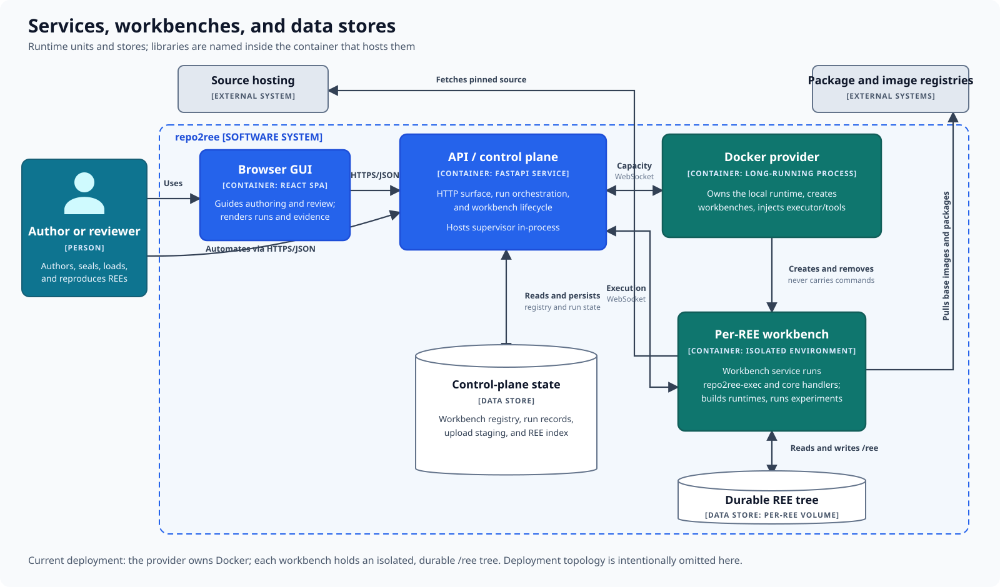

# Services, workbenches, and data stores

repo2ree consists of several running applications and two distinct kinds of
state. Separating them keeps coordination outside the environment that executes
repository code.

## Runtime elements

| Element | Responsibility |
|---|---|
| Browser interface | Guides authoring and review and presents runs and evidence. |
| API and control plane | Accepts requests, orchestrates runs, and manages workbench lifecycle. |
| Workbench agent | Owns its host's runtime, provisions workbenches, injects tools, and carries messages. |
| Per-REE workbench | Runs repo2ree operations, builds runtime artifacts, and executes experiments. |
| Control-plane state | Stores workbench routing, run records, staged uploads, and the REE index. |
| Durable REE tree | Stores one REE's source, overlay, workspace, artifacts, results, runs, and reviews. |

## Ownership boundaries

The API does not control the container runtime directly. The workbench agent
connects outward to the control plane and performs runtime operations on its
behalf. Commands execute inside a persistent, isolated workbench.

Control metadata and REE contents also have different owners. The control plane
keeps routing and operation state; the workbench volume keeps the durable REE
tree. A workbench process can therefore be recreated around persisted REE
state.

Deployment details such as proxies, replicas, and host layout are outside this
map. The next pages open the [control plane](control-plane.md) and
[workbench agent](workbench-agent.md) to show their internal responsibilities.

