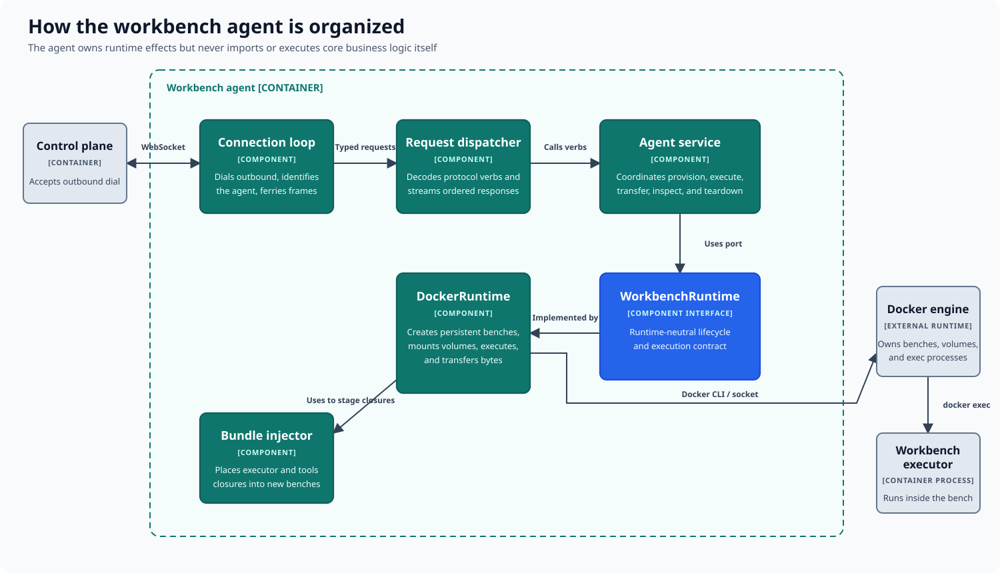

# How the workbench agent is organized

The workbench agent owns runtime effects on its host. It places and drives
workbenches, but the actual repo2ree operation runs inside the isolated
workbench rather than in the agent itself.

## Responsibilities

| Area | Responsibility |
|---|---|
| Connection management | Connects outward to the control plane, identifies the agent, and carries ordered messages. |
| Request handling | Decodes operation requests and streams their responses. |
| Agent service | Coordinates provisioning, execution, transfer, inspection, and teardown. |
| Runtime interface | Defines runtime-neutral lifecycle and execution operations. |
| Docker runtime | Implements those operations with persistent workbenches, volumes, transfers, and command execution. |
| Tool injection | Places the versioned executor and tools into a newly provisioned workbench. |

The outbound connection lets a control plane reach agents behind common network
boundaries without exposing an inbound agent service. Requests pass through the
agent service to the configured runtime implementation, and responses return
over the same session.

For execution, the runtime starts the injected executor inside the workbench.
This keeps repository evaluation, builds, and experiments on the isolated side
of the boundary. Docker is the current implementation, but the runtime
interface allows other execution substrates.

