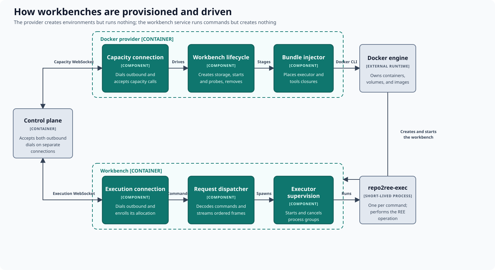

# How workbenches are provisioned and driven

Two deployables sit on the compute side of the boundary, and they deliberately
have different authority. A **provider** creates and removes environments but
can never run an REE command. A **workbench service** runs REE commands inside
one environment but can never create or destroy infrastructure.

## The provider: capacity only

| Area | Responsibility |
|---|---|
| Capacity connection | Connects outward to the control plane and accepts typed capacity calls. |
| Workbench lifecycle | Creates storage, starts and probes the environment, and removes it on release. |
| Bundle injection | Places the versioned executor and tools closures into a new environment. |

The provider holds the container-runtime socket. It never receives an REE
command and never sits in the execution path, so a compromised provider
credential cannot run repository code.

## The workbench service: execution only

| Area | Responsibility |
|---|---|
| Execution connection | Connects outward to the control plane and identifies its workbench and allocation. |
| Request dispatch | Decodes typed commands and streams ordered logs, results, and file transfers. |
| Executor supervision | Starts one short-lived executor per command and cancels its process group. |

The service starts inside the environment the provider created and dials the
control plane itself, presenting an enrollment credential scoped to that one
allocation. From then on commands travel directly between the control plane and
the workbench.

Both connections are outbound, which lets a control plane reach compute behind
common network boundaries without exposing an inbound endpoint on either side.

For execution, the service starts the injected executor inside the workbench.
This keeps repository evaluation, builds, and experiments on the isolated side
of the boundary. Docker is the current substrate, but nothing in the execution
path depends on it.
