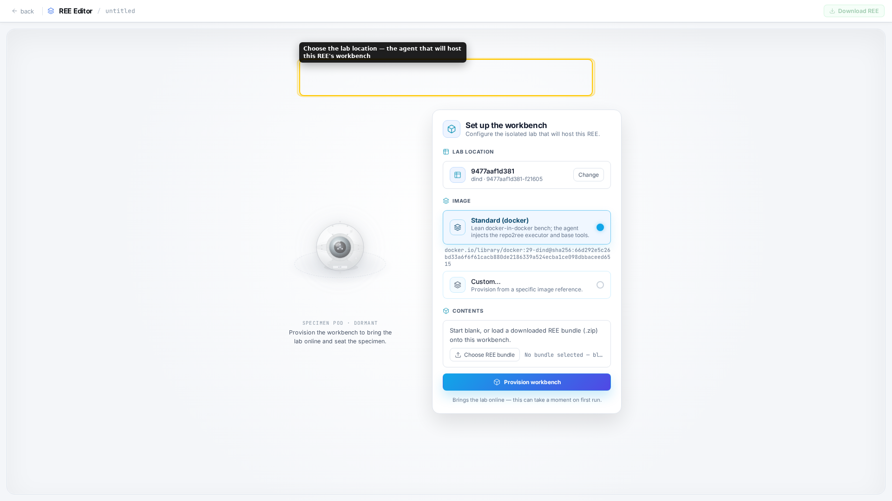
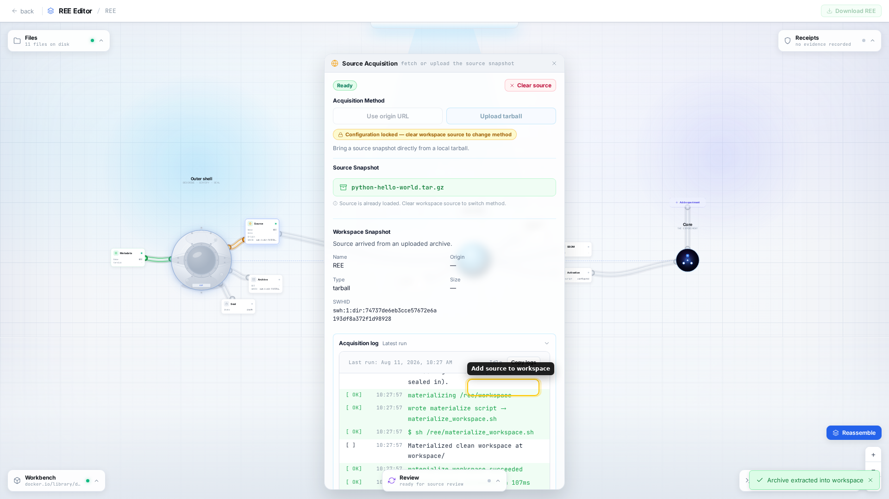
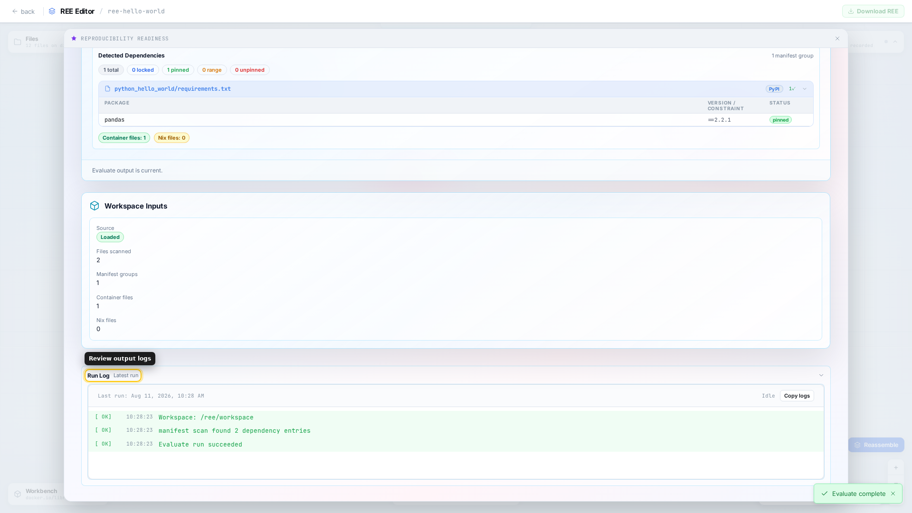
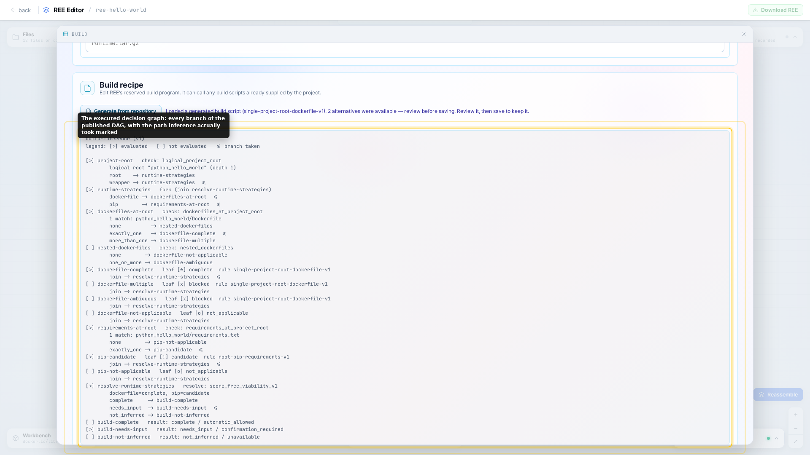
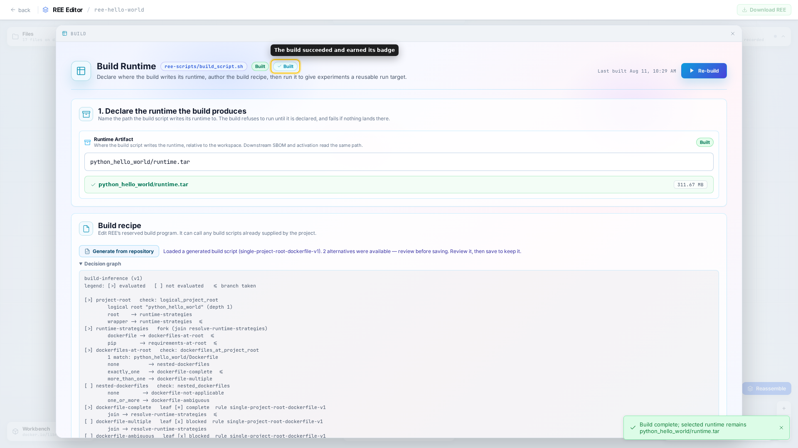
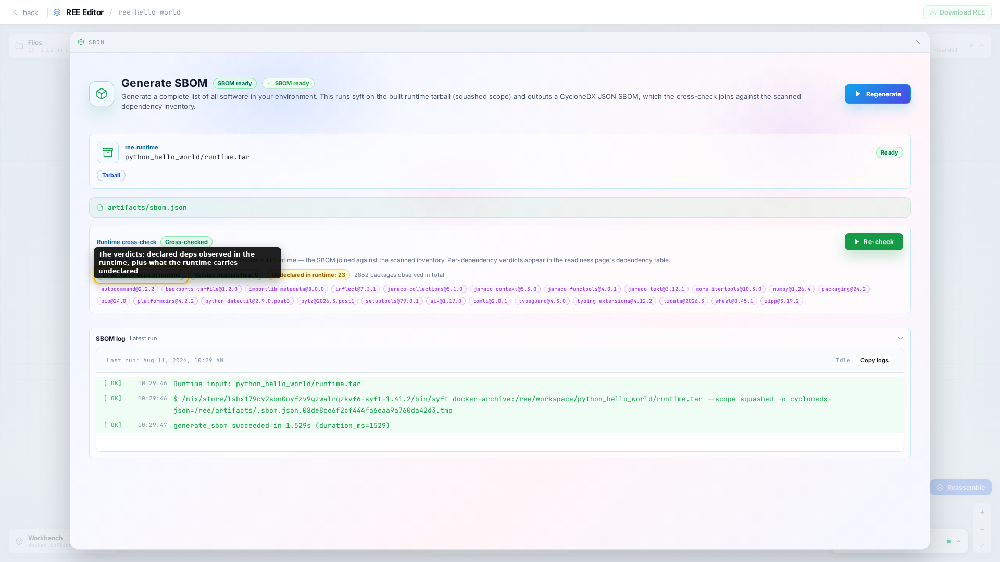
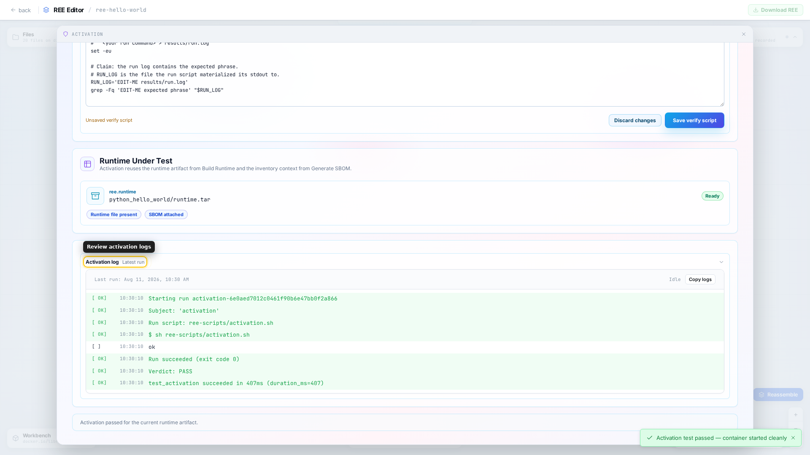
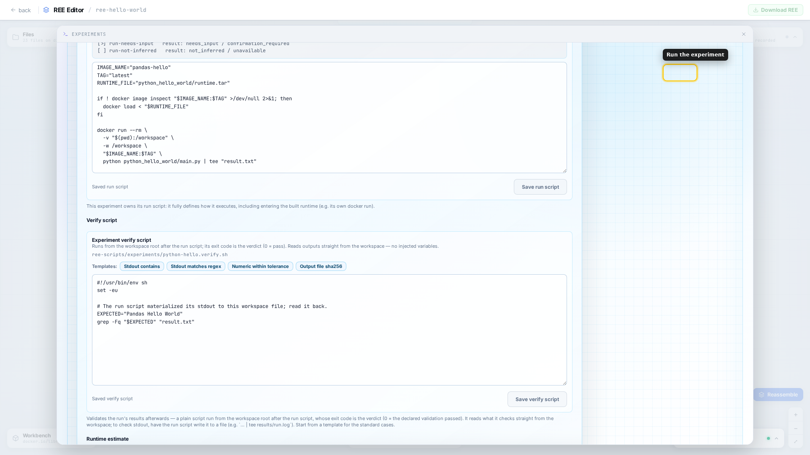
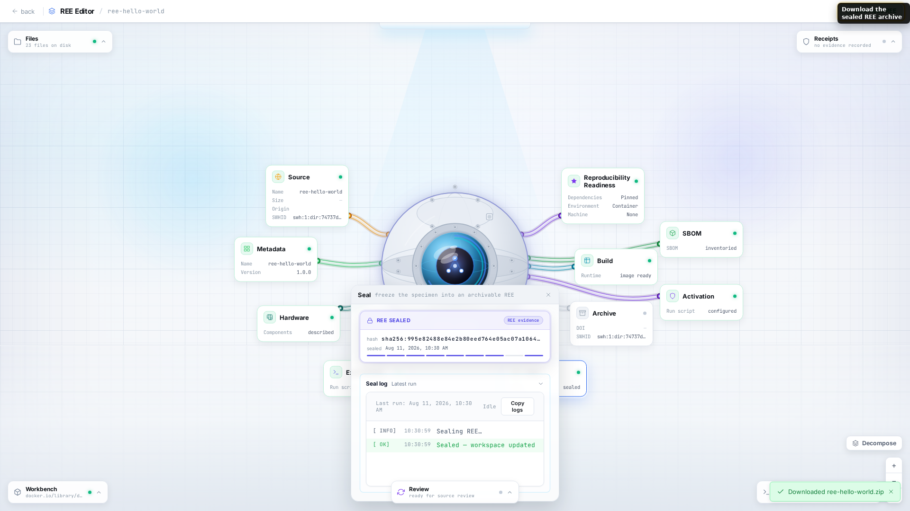

# Create your first REE

In this tutorial you will turn a small Python project into a Reproducible
Execution Environment (REE). You will acquire its source, build a runtime,
record software and hardware context, run a checked experiment, and download a
sealed bundle that can reproduce itself without repo2ree.

The tutorial assumes that you use a hosted repo2ree service. You do not need to
install repo2ree or administer its execution infrastructure.

## Concepts you will use

Read this section before starting the application. The terms describe one
continuous chain rather than independent features:

```text
source snapshot + authored overlay
                 ↓
             workspace
                 ↓ build recipe
         runtime artifact
                 ↓
       activation + experiment
                 ↓
        evidence and results
                 ↓
            sealed REE
```

### Reproducible Execution Environment

**A Reproducible Execution Environment (REE) is a portable record containing the inputs, instructions, evidence, and results needed to understand and repeat a computation.**

A REE is more than a container image and more than a copy of a source
repository. It connects a particular source snapshot to the recipes used to
build and enter an environment, the commands used to produce results, and the
checks used to judge those results. You need this combined record because
sharing any one part alone leaves a future reader to guess how the parts fit
together.

### Control plane, agent, and lab location

**The control plane records intent, while an agent carries that intent to the execution infrastructure identified in the GUI as a lab location.**

The GUI and API belong to the control plane: they coordinate work but do not
hold a container-runtime socket. A separately running agent connects outbound
to the API and owns Docker on its host. Choosing a lab location therefore
chooses which connected agent will host the work. This separation lets
repo2ree coordinate execution without requiring the hosted service to own
credentials or direct access to a user's infrastructure.

### Workbench

**A workbench is the isolated, disposable environment in which repo2ree assembles and tests one REE.**

The workbench holds the working files, invokes the build tools, and runs the
author's scripts. It exists to isolate potentially untrusted project code and
to give the authoring process a controlled filesystem. It is not the product:
you can release the workbench after sealing the REE because the portable record
must outlive the machinery that created it.

### Source snapshot and source identity

**A source snapshot is the exact source tree used for the REE, and its source identity records which tree those bytes represent.**

In this tutorial the snapshot comes from an uploaded tarball. repo2ree preserves
that upstream input and records a Software Heritage identifier (SWHID) for its
tree. A stable identity matters because a repository name or mutable branch
does not establish which code an author actually evaluated and built.

### Overlay

**The overlay is the REE-specific material authored beside the original source, such as build, activation, experiment, and verification scripts.**

Keeping these instructions beside the source rather than rewriting it lets
repo2ree describe an existing project without pretending that generated or
author-supplied reproducibility files came from upstream. The distinction
preserves provenance and makes it possible to reconstruct the same working tree
later.

### Workspace

**The workspace is the materialized execution view formed from the preserved source and the authored overlay.**

Build and run scripts execute from this view. repo2ree can recreate it from its
two inputs, so generated files and effects of a prior run do not become the
authoritative source by accident. A derived workspace enables clean
re-execution while keeping the upstream snapshot unchanged.

### Evaluation

**Evaluation is a read-only assessment of the source declarations and their reproducibility risks.**

It finds dependency manifests, version constraints, container definitions, and
other signals before a runtime exists. Evaluation exposes what the project
claims and what may drift, but it does not prove that a build succeeds or that
declared dependencies appear in the resulting environment.

### Build recipe

**A build recipe is the executable, author-approved instruction that constructs the REE's runtime artifact.**

repo2ree can infer a candidate by inspecting repository facts, and its decision
graph explains why repo2ree proposed a strategy. The author must still inspect
and confirm the recipe because choosing how a project should build is a
substantive claim. Recording the recipe lets a reviewer rebuild the environment
instead of receiving an unexplained binary.

### Runtime artifact

**A runtime artifact is the reusable execution environment produced by the build recipe and later entered by activation and experiment scripts.**

In this tutorial the runtime is a Docker image exported to `runtime.tar`. It is
not the workbench, the Docker daemon, or an individual experiment container:
the workbench builds it, Docker restores it, and separate runs enter it. The
runtime gives every experiment the same declared software environment and gives
reviewers a concrete environment to replay or rebuild.

### SBOM and HBOM

**An SBOM inventories software observed in the runtime, while an HBOM describes hardware context that may affect the computation.**

The Software Bill of Materials answers what the built environment actually
contains; cross-checking it against evaluation reveals whether declared
dependencies reached the runtime and which packages appeared without direct
declarations. The Hardware Bill of Materials records relevant CPU, GPU, memory,
storage, or network context. Both matter because software declarations and
hardware assumptions can diverge from the environment that produced a result.

### Activation

**Activation is a small, author-defined test that proves Docker can restore, enter, and use the built runtime.**

For this Python example, activation starts the image and runs a Python command.
It deliberately answers a narrower question than the experiment: “Can this
environment start and execute its basic tool?” This gate prevents confusion
between an experiment failure and a runtime that never became usable.

### Experiment

**An experiment is a declared command that runs inside the runtime and produces named outputs.**

The experiment is the computation whose behavior matters to the author. Its run
script owns the full execution path, including how it enters the runtime and
where it writes results. Declaring the command and outputs lets repo2ree capture
the right baseline and lets a reviewer repeat the same operation rather than
reconstructing it from prose.

### Verify script and validation

**A verify script is an executable success criterion, and validation means that one run and its verify script both passed.**

The verify script reads ordinary output files and communicates its verdict with
its exit status. This makes the claim inspectable: in this tutorial it checks
that stdout contains `Pandas Hello World`. The exit code matters because “the
command ran” does not say whether it produced an acceptable result. Validation
describes the author's current run only; it is not yet independent
reproduction.

### Evidence and receipts

**Evidence is the recorded observation from an operation, and a receipt binds that observation to the operation and REE state that produced it.**

Build status, logs, artifact paths, package inventories, activation verdicts,
and experiment-output digests all contribute evidence. repo2ree uses this
record to show which conclusions are current and which became stale after an
input changed. Evidence keeps a green badge traceable to what ran instead of
letting it become an unsupported assertion.

### Sealing, reproduction, and archiving

**Sealing freezes and identifies a shareable REE, reproduction compares a later run with its author evidence, and archiving deposits the sealed object with a durable repository.**

The seal binds the selected source, overlay, artifacts, results, and evidence
under a digest and packages them with a shell reproducer. Running that package
later is what enables reproduction; another run must still compare its outcome
with the recorded baseline. Archiving is a separate publication step that may
issue a DOI or another persistent identifier. These distinctions prevent
“sealed,” “reproduced,” and “published” from overstating one another.

For the object you just built, described field by field, see
[Anatomy of an REE](../reference/ree-anatomy.md).

## Scope of this exercise

This exercise teaches the repo2ree authoring workflow with a deterministic toy
program. It demonstrates how to preserve source, build an environment, declare
an experiment, record evidence, and package the result. It does not by itself
demonstrate that a real scientific claim is reproducible.

For a real analysis, you must also identify research data and its access terms,
declare parameters and random seeds, capture relevant machine constraints, and
choose a scientifically meaningful comparison for the outputs. Those decisions
belong to the researcher; repo2ree can record and execute them but cannot infer
what counts as equivalent scientific evidence.

## Watch the complete workflow

This optional, silent recording shows the complete workflow described below,
from provisioning a workbench to downloading the sealed REE. Every action and
result also appears in the written tutorial.

<video controls playsinline preload="metadata"
       poster="assets/create-first-ree/09-seal.png"
       aria-label="Complete repo2ree authoring workflow"
       style="width: 100%; height: auto;">
  <source src="assets/create-first-ree/demo.webm" type="video/webm">
  Your browser cannot play the recording.
  <a href="assets/create-first-ree/demo.webm">Download the WebM recording</a>.
</video>

## What you need

- access to a hosted repo2ree service with at least one available lab location;
- the [Python hello-world source archive](assets/downloads/python-hello-world.tar.gz),
  downloaded to your computer.

Open the repo2ree address supplied by your service operator. The service handles
workbench provisioning, runtime builds, and storage on your behalf.

## 1. Create an isolated workbench

Select **Create REE**, choose the connected lab location, and keep the
**Standard (docker)** workbench image. Select **Provision workbench**.



The lab location is the agent that owns the execution infrastructure. The
workbench is the isolated, disposable place where repo2ree assembles this REE;
it is not the final artifact.

Once the editor opens, select **Decompose**. This exposes the source, build,
activation, experiment, and evidence areas that you will work through.

## 2. Acquire a source snapshot

Open **Source**, select **Upload tarball**, and choose
the downloaded `python-hello-world.tar.gz`. Select **Add to workspace** and wait
for the acquisition run to succeed.



repo2ree preserves the uploaded archive as the upstream source and materializes
a workspace from it. The recorded SWHID identifies the acquired source tree.
The workspace is a derived build view, so authoring files do not have to alter
the upstream snapshot.

Open **Metadata** and enter:

- name: `ree-hello-world`;
- version: `1.0.0`;
- description: `A reusable execution environment for the Python hello world archive.`

Open **Hardware**. If the service reports the execution host's CPU model, add a
CPU and record that model exactly. If the service does not expose this
information, leave the entry absent rather than guessing. An incomplete HBOM is
an honest limitation; invented hardware metadata is misleading provenance.

## 3. Evaluate the source

Open **Reproducibility Readiness** and select **Run Evaluate**. The analysis
finds the project manifest, its pinned `pandas==2.2.1` dependency, and the
Dockerfile that can build the project.



Evaluation inspects declarations in the source. It does not prove that those
dependencies reached the built runtime; the SBOM cross-check later answers
that different question. Also notice that pinning `pandas==2.2.1` does not pin
the Docker base image or every package fetched during the build. The evaluation
is a risk assessment, not a guarantee that the same build will work later.

## 4. Build and declare the runtime

Open the inner shell with **Open build runtime**, then select **Generate from
repository**. Inspect both the proposed script and its decision graph.



Inference found both a Dockerfile and a Python requirements file. It proposes a
Docker build, but the author still owns that choice. Save this build script:

```sh
#!/usr/bin/env sh
set -eu

IMAGE_NAME="pandas-hello"
TAG="latest"
PROJECT_DIR="python_hello_world"
RUNTIME_FILE="$PROJECT_DIR/runtime.tar"

echo "Building $IMAGE_NAME:$TAG from $PROJECT_DIR..."
docker build -t "$IMAGE_NAME:$TAG" "$PROJECT_DIR"

echo "Exporting image to $RUNTIME_FILE..."
docker save "$IMAGE_NAME:$TAG" -o "$RUNTIME_FILE"
```

Declare `python_hello_world/runtime.tar` as the **Runtime Artifact**, then
select **Run build**. Watch the log until the **Built** outcome appears.



Declaring the artifact before running the build creates a checkable contract:
the recipe says where it writes the runtime, and the build fails if that file
does not appear.

## 5. Inspect the runtime and test activation

Open **SBOM**, select **Generate**, and then **Cross-check**. The generated
CycloneDX inventory describes what is actually present in the runtime. The
cross-check joins that inventory with the dependency declarations found during
evaluation.



Seeing transitive packages as undeclared is normal here: the source directly
declares pandas, while the built environment also contains packages installed
as its dependencies.

Open **Activation** and select **Generate from repository**. repo2ree can infer
how to load and enter the saved container image, but it deliberately leaves the
proof of usability to you. Keep the generated runtime-loading scaffold and
replace its fail-closed placeholder so the complete script reads:

```sh
#!/usr/bin/env sh
set -eu

IMAGE_NAME="pandas-hello"
TAG="latest"
RUNTIME_FILE="python_hello_world/runtime.tar"

if ! docker image inspect "$IMAGE_NAME:$TAG" >/dev/null 2>&1; then
  docker load < "$RUNTIME_FILE"
fi

docker run --rm \
  -v "$(pwd):/workspace" \
  -w /workspace \
  "$IMAGE_NAME:$TAG" \
  python -c "import sys; print('ok')"
```

Save the script and select **Run activation**.



Activation now establishes a small but explicit claim: the built runtime can
start and run Python successfully.

## 6. Declare and verify an experiment

Open **Experiments**, add an experiment, and name it `python-hello`. Generate
its run script from the repository. As with activation, repo2ree supplies the
runtime plumbing but leaves the scientific command to the author.

Keep the generated scaffold and set the complete run script to:

```sh
#!/usr/bin/env sh
set -eu

IMAGE_NAME="pandas-hello"
TAG="latest"
RUNTIME_FILE="python_hello_world/runtime.tar"

if ! docker image inspect "$IMAGE_NAME:$TAG" >/dev/null 2>&1; then
  docker load < "$RUNTIME_FILE"
fi

docker run --rm \
  -v "$(pwd):/workspace" \
  -w /workspace \
  "$IMAGE_NAME:$TAG" \
  python python_hello_world/main.py | tee "result.txt"
```

The final `tee` materializes stdout as `result.txt`, giving the verifier an
ordinary workspace file to inspect. Use this verify script:

```sh
#!/usr/bin/env sh
set -eu

EXPECTED="Pandas Hello World"
grep -Fq "$EXPECTED" "result.txt"
```

Declare `result.txt` as an output file, save both scripts, and select **Run**.
The run passes only when the experiment completes and the verify script exits
with status zero.



This distinction is central: executing a command produces a result, while the
verify script states the criterion that makes that result acceptable. A future
reviewer can rerun both rather than trusting a success label alone. This
tutorial's string check is intentionally minimal: it proves that the expected
message appeared, not that pandas produced a scientifically equivalent result.
A real analysis should compare its declared outputs with a method appropriate
to the result, such as exact hashes, numeric tolerances, structured comparisons,
or statistical tests.

## 7. Seal and reproduce the REE

Select **Reassemble**, open **Seal**, review the bundle contents, and select
the source, runtime, and `python-hello` result baseline for inclusion. Then
select **Seal REE** and download the resulting ZIP archive.



The seal digest identifies the complete record rather than its human-readable
name. The archive contains the selected source and runtime payloads, authored
scripts, evidence, experiment baseline, and a portable shell reproducer. You
have sealed the bundle and validated its experiment, but nobody has yet
reproduced it independently or deposited it in a citable archive.

You have now completed the hosted workflow. If your computer has a POSIX shell,
Docker, and an archive extractor, you can optionally test the bundle outside
repo2ree. Extract it into a new directory and inspect the available commands:

```bash
unzip ree-hello-world.zip -d ree-hello-world
cd ree-hello-world
sh run.sh list
```

Then replay the complete supported sequence:

```bash
sh run.sh all
```

This optional run creates the first independent reproduction attempt. The
reproducer does not require repo2ree itself, but it does require the runtimes
and tools used by the author's scripts. Compare the new output and verdict with
the author baseline; successful replay, comparison, and validation support a
reproduction claim.

This is the tutorial's payoff: the hosted workbench helped author the record,
while the downloaded record is portable beyond that workbench and the repo2ree
service.

Return to the workbench console and select **Release workbench**. You can safely
discard this execution environment after downloading the bundle.

## What you learned

You followed the complete authoring chain:

1. source snapshot;
2. source evaluation;
3. authored build recipe and declared runtime;
4. runtime SBOM and dependency cross-check;
5. activation proof;
6. experiment plus explicit verification;
7. sealed, independently runnable bundle.

Next, use [Verify a result](../how-to/verify.md) and the Review console when you
want repo2ree to record and compare an independent attempt against another
author's evidence. The standalone `run.sh` remains the service-free portability
path.
