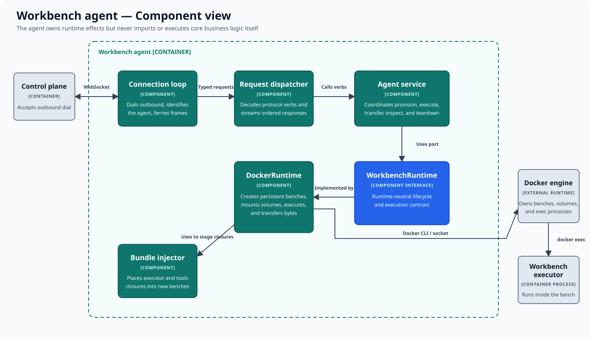

# Workbench agent components

This component view opens the workbench agent. The agent owns runtime effects
on its host, but it does not import or execute repo2ree's core business logic.

## Components

| Component | Responsibility |
|---|---|
| Connection loop | Dials the control plane, identifies the agent, and ferries ordered frames. |
| Request dispatcher | Decodes typed protocol verbs and streams their responses. |
| Agent service | Coordinates provisioning, execution, transfer, inspection, and teardown operations. |
| `WorkbenchRuntime` | Defines the runtime-neutral lifecycle and execution interface. |
| `DockerRuntime` | Implements that interface with persistent benches, volumes, transfers, and `docker exec`. |
| Bundle injector | Places versioned executor and tools closures into a newly provisioned workbench. |

## Main flow

The outbound connection lets a control plane reach agents behind common network
boundaries without exposing an inbound agent service. A typed request moves
from the connection loop through the dispatcher and service to the runtime
port. The Docker implementation performs the requested effect and returns
protocol frames along the same session.

For command execution, the runtime starts the injected executor inside the
workbench. The executor—not the agent—loads core handlers. This keeps the agent
as a runtime and transport boundary and keeps domain execution inside the
isolated environment.

## Outside this view

Docker is the current runtime implementation, not the architectural interface.
Alternative substrates can implement `WorkbenchRuntime` without moving core
logic into the agent. Workbench internals and the `/ree` tree are described in
the [execution and isolation architecture](../architecture.md).

