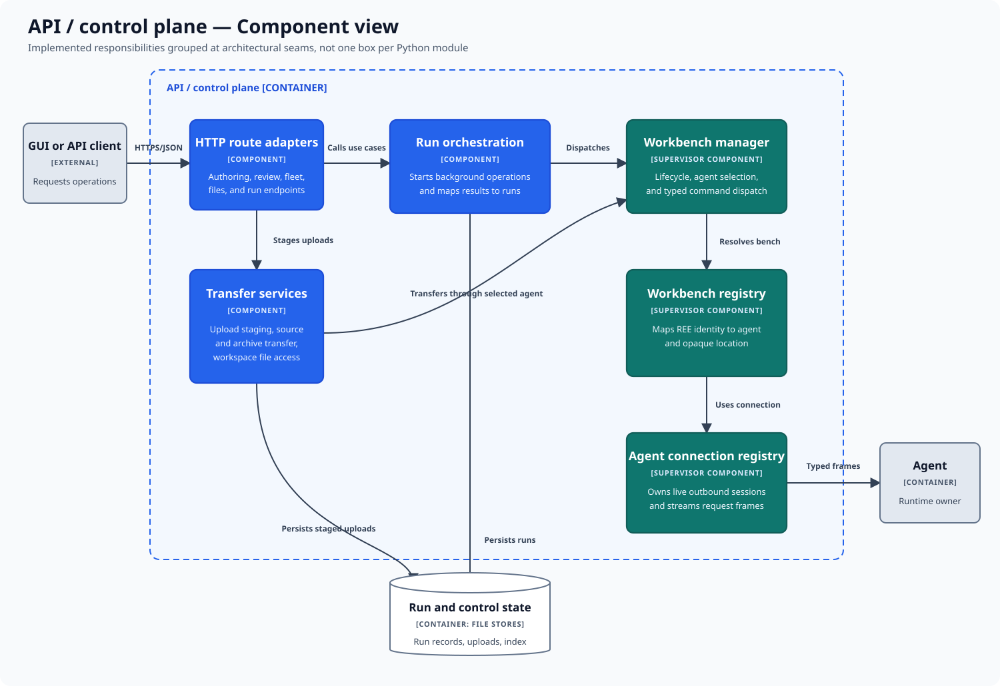

# API and control-plane components

This component view opens the API/control-plane container. The boxes group
implemented responsibilities at architectural seams; they are not a
one-box-per-Python-module inventory.

## Components

| Component | Responsibility |
|---|---|
| HTTP route adapters | Translate authoring, review, fleet, file, and run requests into use-case calls. |
| Run orchestration | Starts background operations and maps their progress and results onto run records. |
| Transfer services | Stage uploads and move source, archives, and workspace files through the selected agent. |
| Workbench manager | Selects an agent, manages workbench lifecycle, and dispatches typed commands. |
| Workbench registry | Maps an REE identity to its agent and opaque workbench location. |
| Agent connection registry | Owns live agent-dialed sessions and streams request and response frames. |
| Run and control state | Persists run records, uploads, the REE index, and other control-plane data. |

## Main flow

Routes validate and translate an incoming HTTP request. Longer work is accepted
as a background run. Orchestration asks the supervisor's workbench manager to
resolve the REE's workbench and dispatch work through its connected agent.
Frames returning from the agent update the run record, which the client can
poll independently of the original request.

Transfers follow the same ownership rule: the control plane stages and
coordinates data, while the selected agent performs effects at the workbench.
The API does not bypass the agent to inspect or modify a workbench.

## Outside this view

This view does not decompose the GUI, agent, or workbench. It also does not
claim that every component is a distinct process or class. See
[execute one pipeline stage](dynamic-stage-execution.md) for the interaction in
time and [component and package architecture](../components.md) for source
package dependency rules.

