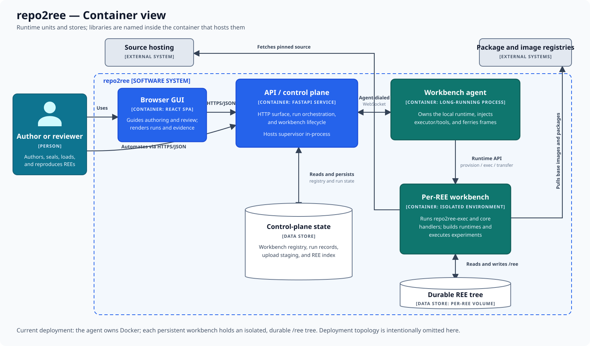

# Container view

The container view opens the repo2ree system boundary and shows the runtime
units and stores that participate in authoring and review. Here, *container* is
a C4 term for an application or data store, not necessarily a Docker container.

## Runtime units and stores

| Element | Responsibility |
|---|---|
| Browser GUI | Guides authoring and review and presents runs and evidence. |
| API / control plane | Exposes HTTP operations, orchestrates runs, and hosts the supervisor library in-process. |
| Workbench agent | Owns its host's runtime, provisions workbenches, injects tools, and ferries protocol frames. |
| Per-REE workbench | Runs the executor and core handlers, builds runtimes, and executes experiments. |
| Control-plane state | Stores workbench routing, run records, staged uploads, and the REE index. |
| Durable REE tree | Stores one REE's source, overlay, workspace, artifacts, results, runs, and reviews. |

## Boundaries and state ownership

The API never owns a container-runtime socket. The agent dials the control
plane over a WebSocket and is the only repo2ree container that talks to the
runtime API. It invokes the injected executor inside a persistent, isolated
workbench.

Control metadata and REE contents have different owners. The control plane
keeps routing and operation state; the workbench volume keeps the durable
`/ree` tree. A workbench process can therefore be recreated around persisted
REE state.

## Outside this view

Deployment topology, replicas, proxies, and the agent host are intentionally
omitted. Libraries are named inside the runtime unit that hosts them rather
than drawn as separately deployable services. Continue with the
[API/control-plane](component-api-control-plane.md) or
[agent](component-agent.md) component view to open either side of the network
boundary.

