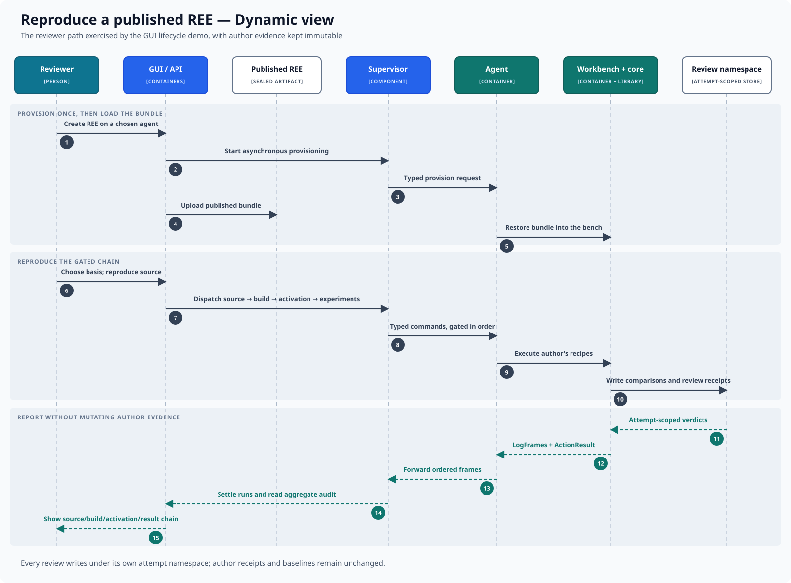

# Reproduce a published REE

This dynamic view follows a reviewer from a sealed artifact to an independent,
attempt-scoped verdict. It emphasizes that author evidence remains immutable.

## Interaction

1. The reviewer creates an REE on a chosen agent; the supervisor provisions its
   workbench once.
2. The published bundle is uploaded and restored into that workbench.
3. The reviewer chooses the reproduction basis and starts source reproduction.
4. The control plane dispatches the gated source, build, activation, and
   experiment commands in order through the supervisor and agent.
5. Core executes the author's recipes and writes comparisons and review
   receipts beneath a fresh attempt namespace.
6. Attempt-scoped verdicts, log frames, and action results return through the
   agent and settle the corresponding runs.
7. The UI reads the aggregate audit and presents the source, build, activation,
   and result chain.

## Evidence boundary

Each review attempt has its own `reviews/<review_id>/` tree. It may compare
against author baselines, but it never rewrites author receipts or results.
Provisioning a new review does not mean provisioning one workbench per stage or
per attempt: the loaded REE has one workbench, and attempts are isolated by
their namespaces inside its durable tree.

The exact verdict ladder, reproduction bases, and comparison semantics are
defined in [review evidence](../../engineering/explanation/review-evidence.md).

