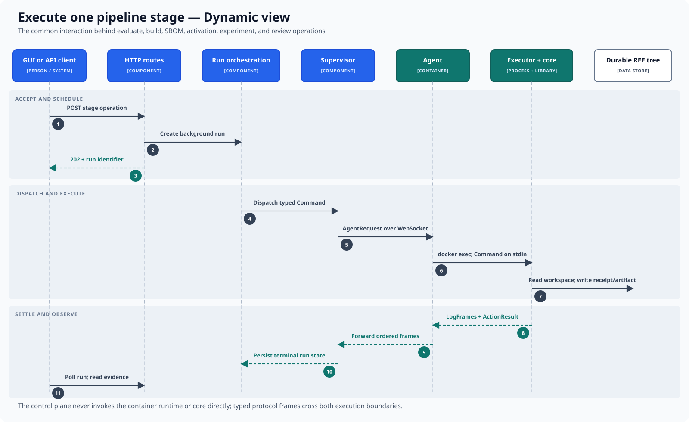

# Execute one pipeline stage

This dynamic view shows the common asynchronous interaction used by evaluation,
build, SBOM, activation, experiment, and review operations.

## Interaction

1. A client posts a stage operation to an HTTP route.
2. The control plane creates a background run and immediately returns `202`
   with its run identifier.
3. Run orchestration constructs a typed command and asks the supervisor to
   dispatch it.
4. The supervisor resolves the workbench and sends an agent request over the
   selected agent's WebSocket.
5. The agent invokes the executor in that workbench, passing the command on
   standard input.
6. The executor loads core, which reads the workspace and writes the relevant
   receipt or artifact to the durable REE tree.
7. Log frames and the terminal action result travel back through the agent.
8. Orchestration persists terminal run state; the client polls the run and
   reads the resulting evidence.

## Guarantees shown by the sequence

HTTP request lifetime is decoupled from execution lifetime. Typed protocol
messages cross both effect boundaries, and returned frames remain ordered. The
control plane neither invokes the runtime nor calls core directly. Durable
evidence is written where execution occurs, while observable run state is
settled in the control plane.

The diagram describes one stage, not the dependency rules between stages. Those
gates and their receipts are covered by the
[step lifecycle](../../engineering/explanation/step-lifecycle.md).

