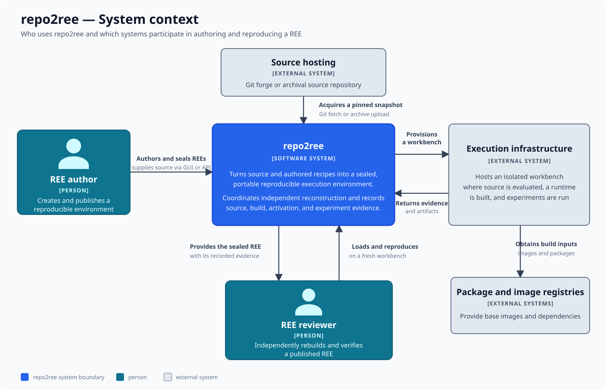

# System context

The system-context view establishes repo2ree's boundary, its users, and the
external systems involved in authoring and independently reproducing a
Reproducible Execution Environment (REE). It intentionally hides repo2ree's
internal applications and services.

## People and systems

- **REE authors** supply source and recipes, exercise the environment, and seal
  the resulting REE with its evidence.
- **REE reviewers** load a published REE and independently reproduce it in a
  fresh workbench.
- **repo2ree** coordinates both workflows and records evidence for source,
  build, activation, and experiment steps.
- **Source hosting** supplies a pinned Git snapshot or an uploaded archive.
- **Execution infrastructure** hosts the isolated workbench in which evaluation,
  builds, and experiments run.
- **Package and image registries** supply external build inputs to that
  infrastructure.

## Relationships to notice

The REE is the artifact passed from author to reviewer; the author's running
workbench is not shared. Both workflows rely on execution infrastructure, but
repo2ree coordinates it rather than exposing that infrastructure directly to
the user. Source and dependencies enter through different trust and provenance
paths and are recorded as inputs to the work.

## Outside this view

This diagram does not show the GUI, API, agent, executor, data stores, or a
deployment topology. Open the [container view](containers.md) for those runtime
boundaries. The detailed meaning of a sealed REE and its evidence belongs in
the [concept reference](../concepts.md).

